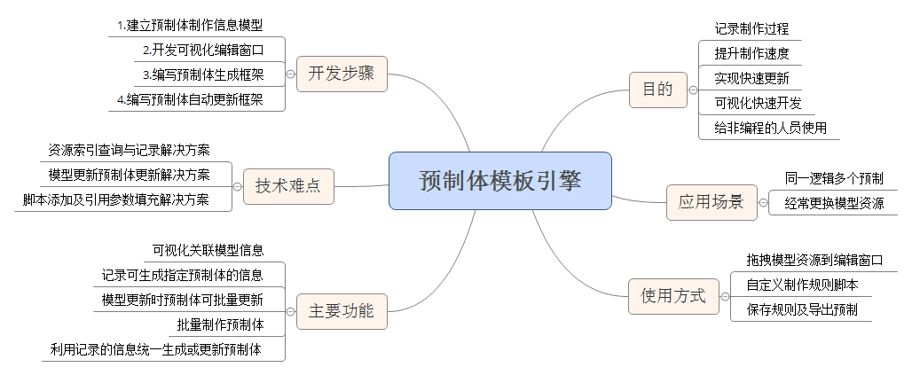

# Prefab-Generator
assemble some of prefab by models and scripts,we can charge script or model

## What?
when i build some prefabs,update and create will make many times,but the logic of throse project is actualy the same,and i can not find some solution in assetAtore,so i want build one,or just wait you to make it out.
## How?
actually this project can not use for this moment,and i just have some idears like this

## When?
when this project can work,the time can not	estimate
## Support?
meybe you have more ideras,thank you to warning me
